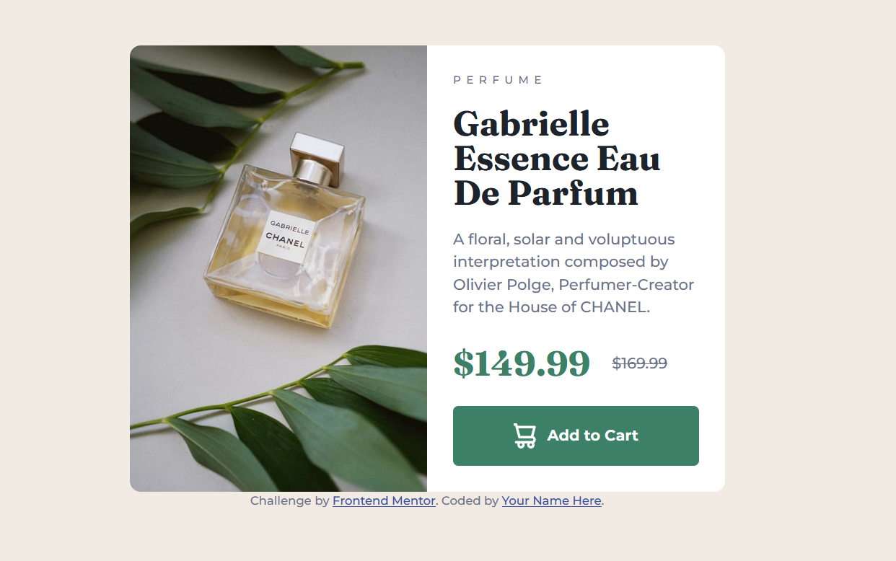

# Frontend Mentor - Product preview card component solution

This is a solution to the [Product preview card component challenge on Frontend Mentor](https://www.frontendmentor.io/challenges/product-preview-card-component-GO7UmttRfa). Frontend Mentor challenges help you improve your coding skills by building realistic projects.

## Table of contents

- [Overview](#overview)
  - [The challenge](#the-challenge)
  - [Screenshot](#screenshot)
  - [Links](#links)
- [My process](#my-process)
  - [Built with](#built-with)
  - [Useful resources](#useful-resources)
- [Author](#author)
- [Acknowledgments](#acknowledgments)

## Overview

### The challenge

Users should be able to:

- View the optimal layout depending on their device's screen size
- See hover and focus states for interactive elements

### Screenshot

### Links

- Solution URL: https://www.frontendmentor.io/solutions/product-preview-card-component-qYWl_SMWSG
- Live Site URL: https://rach1975.github.io/product-preview-card-component-main/

## My Process

### Built with

- Semantic HTML5 markup
- CSS custom properties
- Flexbox
- CSS Grid

### Useful resources

- [Kevin Powell's Youtube](https://www.youtube.com/watch?v=B2WL6KkqhLQ)

### Problems to follow

How to deploy website on Github to make svgs visible?

## Author

- Frontend Mentor - [@Rach1975](https://www.frontendmentor.io/profile/Rach1975)

## Acknowledgments

This is my first time actually to write frontend codes so I stumbled upon things. Kevin's video really did help me out figuring out several difficult points.

Thanks to [バレンタイン 😈](https://www.frontendmentor.io/profile/vcarames) for helping me out in improving accessibility!
